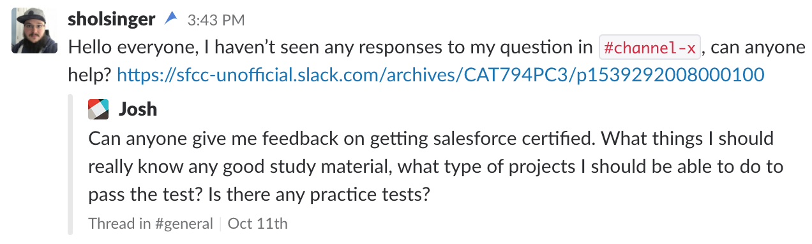

# Getting Started

Welcome to the [Unofficial Salesforce B2C Commerce Slack community](https://sfcc-unofficial.slack.com/). We created this community to give everyone access to each other to share ideas and help one another in a near real-time. It also gives members a place to discuss Salesforce B2C Commerce in a free and open environment.

## Setting Up Your Profile

### Name Fields

Please use your actual name in the `Full Name` field. Please also use your real name or a shortened form of your real name in the `Display name (optional)` field. You do not need to submit a `Display name (optional)` value if you are happy with everyone seeing your `Full Name`.

This community is expected to be a professional environment. The community does not benefit from anyone masquerading as another. It is requested that you not use fictional character names in either field. Violating this request may be grounds for deactivation of your account.

### What I do

Please provide a brief summary of what you do and who you do it for. Openness in our community is helpful in developing a strong network. Knowing where someone works or their job role increases their credibility within the community. You do not _need_ to provide your employer's name, but it does help increase credibility.

Please see the below examples:

* Junior Developer at Northern Trail Outfitters
* Technical Architect at Salesforce
* Business Analyst at System Integrator X

### Profile photo

Please upload a unique Profile photo or avatar as they are sometimes called. This will allow members of the community to easily recognize your posts and give you a unique persona within the community. If you don't provide one, your default Profile photo will be a Slack-generated image. However, there are only so many variations of this image and it becomes very monotonous to see the same patterns all over the place.

Example of the Slack default Profile photo:

## Dos and Don'ts

### Do ask questions

There is a [`#newbies`](https://sfcc-unofficial.slack.com/messages/CDG4R5CT1) channel that is a good place for asking questions that don't appear to be relevant for any other channel. Questions that aren't related to newcomers can be asked in [`#general`](https://sfcc-unofficial.slack.com/messages/CAT794PC3). _See also:_ [Do Respect Channel Topics](#do-respect-channel-topics).

### Do respect others

As a community based around a professional topic and setting, respect is a critical value for the success of the community overall. Remember the _Golden Rule_, "Treat others as you would wish to be treated."

### Do respect channel topics

Many channels exist within the community. Some have specific topics such as `#ocapi`, `#einstein`, and `#sfcc-certification`. Others, such as `#general` and `#random` don't have a specific topic. Please try to locate the right place to post your message.

### Do create public channels

If a channel that you feel should exist doesn't exist, go ahead and create it. Keep in mind that there may not be a significant number of community members that may be interested in that topic. "If you build it, they will come" doesn't always apply here. So think about the amount of people who would be interested in that topic before creating a channel dedicated to it.

### Do exercise caution when creating private channels

Private channels cannot later be converted to a public channel. So try to avoid creating them unless you really need to have a small private group. One such legitimate use case is `admin-chat` where the administrators discuss issues relating to the management of the Slack community.

### Don't use this Slack for your company's business

If your workplace doesn't use Slack and you want to use it anyway, don't use this slack for that purpose. Slacks are free to start, go ahead and [create your own](https://slack.com/get-started#create).

### Don't use `@everyone` & `@channel`

Supporting others in the community is a volunteer position. As such, you as a member should have no expectation that others will be as attentive as your coworkers or friends. `@everyone` and `@channel` force notifications to all members of a channel regardless of they are active (being online and having Slack open) or not at that moment. They can become rather noisy to the hundreds of members in channels. Therefore, out of respect for the other members, please remember to avoid using those keywords in your messages. `@here` on the other hand, only notifies the **active** members and might be handy in some situations. Please do not overuse these keywords.

### Don't post content that may be vulgar, offensive, or illegal

As a professional environment, it is not appropriate to share offensive or vulgar content within our Slack community. Additionally, do not share any information that may be illegal in nature. Please consider the global nature of the community when determining the legality of content.

### Don't duplicate content

Let's imagine that you posted a message to `#ocapi` a couple days ago and you're not getting any responses. Your first instinct may be to re-post that same message to `#general` so that it will get more attention. Please don't do that. You can easily copy a link to the message within `#ocapi` and ask in `#general` for someone to look at it in the original channel instead. For example:

Slack will helpfully display an excerpt of your original message for folks to see when you share a link to it.

### Don't create duplicate accounts

This Slack community doesn't restrict your ability to change your email address. Don't worry if you registered with an old employer's email account. You can just change the email address associated with it to your new employer. Simply go to [Account Settings](https://sfcc-unofficial.slack.com/account/settings) and change your email address.
